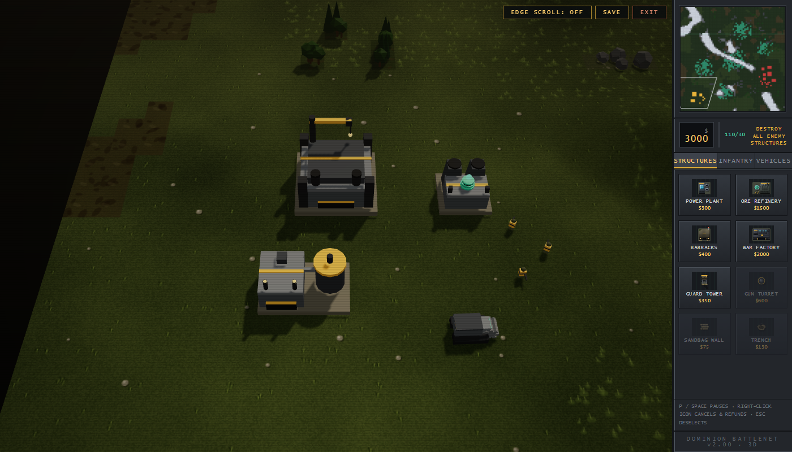
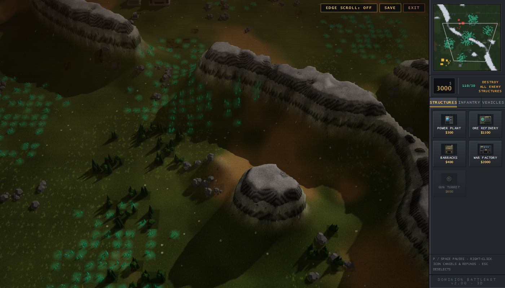

# Iron Dominion 3D

A classic base-building RTS — harvest, expand, hold the line — rendered as real
3D terrain instead of a painted top-down map. Fork of
[Iron Dominion](https://github.com/jackpepper-vibe/iron-dominion), same war,
different camera.

The whole game is one `index.html` ES module with Three.js (r186) vendored
alongside it. No build step and no external assets — but browsers will not load
modules from `file://`, so serve the folder: `npm run serve`, then open
http://localhost:5173/.



## What changed from the 2D game

Nothing about how it plays. The simulation — tile grid, A* pathing, production
queues, power, fog of war, the eight-mission campaign, the AI — is carried over
intact. What was replaced is everything below the line marked
`3D PRESENTATION LAYER`, which only ever reads sim state and never writes to it.

- **The ground is the elevation field the 2D game already had.** It computed a
  terraced heightfield to decide how to *shade* its cliffs; here that same field
  drives an actual 288-quad-a-side mesh, so the massifs you had to path around
  are now massifs you can see over. The 2D terrain painter still runs, and its
  output is draped over the relief as the colour map — minus its baked
  hillshade, because real geometry gets real light.
- **Everything standing on it is modelled.** Thirteen structures and nine units,
  assembled from a shared kit of scaled primitives: sawtooth factory roofs,
  cooling towers, a bucket-wheel harvester whose load visibly fills, tank
  turrets that traverse independently of the hull. Vehicles pitch and roll to
  the slope they are sitting on.
- **Woodland, boulders and ore seams are instanced geometry** placed from the
  same per-tile hash the 2D painter used, so a given map seed still grows its
  trees in the same places.



- **Scorch marks and the fog-of-war shroud ride along as textures** in the ground
  material, which is why `scorch()` and the fog update kept working untouched.
  The shroud is patched into *every* world material, not just the ground — with
  it on the terrain alone, lit trees on unscouted ground gave the map away.

## Commanding it

| Input | Action |
| --- | --- |
| Left-drag | marquee select |
| Right-click | move / attack |
| Right-drag / middle-drag | pan (a right-*click* still orders) |
| Wheel | zoom |
| WASD / arrows | scroll |
| Click radar | jump the camera there |
| `P` / `Space` | pause |
| `Ctrl`+`1`–`5` / `1`–`5` | assign / recall group |
| `E` | toggle edge-of-screen scrolling |
| Right-click a build icon | cancel and refund |

**The camera has a fixed 52-degree rake and does not rotate.** That is a design
decision rather than an unfinished one. Marquee select, the placement ghost,
edge scroll and the radar viewport all stay simple and predictable when yaw is
fixed, and an RTS is played by reading the field, not by flying around it. Zoom
dollies along the rake between roughly a company and a quarter of the map.

Two things are deliberately still flat. The **command overlay** — selection
brackets, health bars, the marquee, floating damage — is drawn in 2D over the
render, because type and brackets that foreshortened with the ground would be
harder to read, not more immersive. The **sidebar icons** are the original 2D
sprite art, which is still the best thing to put in a 188-pixel panel.

## Theatres

Each mission picks one of four lighting grades — ember dusk, cold front, ash
haze, high noon — which sets the sun, the hemisphere fill, the fog band and the
exposure together. Same idea as SkylarkRun changing the light per sector,
re-graded to Iron Dominion's palette.

## Development

```
node scripts/shot.mjs            # mission 1, normal fog
node scripts/shot.mjs 2 reveal   # mission 3, whole map explored
node scripts/smoke.mjs           # functional test
```

`window.ID3` is the test hook — drop into any mission, park the camera, spawn
units, step the simulation without waiting on frames. The game's own state is
module-scoped; `ID3.sim` is the one sanctioned view of it for tests:

```
npm run serve   # in another terminal: http://localhost:5173/
node C:/Claude/Tools/shot/shot.mjs http://localhost:5173/index.html --viewport 1280x800 --wait 2500 \
  --eval "document.getElementById('splash').style.display='none';document.getElementById('intro').style.display='none';ID3.mission(0,true)" \
  --eval "ID3.find('conyard',480)" --out shots/base.png
```

`scripts/smoke.mjs` covers the parts a screenshot cannot: the fork rewrote every
path between the pointer and the simulation — screen-to-world is now a raycast
against the heightfield, entity picking goes through the models, and marquee
selection is a screen rectangle rather than a world one — so those get asserted
rather than eyeballed.

Setup, if ever missing: `npm i -D playwright && npx playwright install chromium`.
